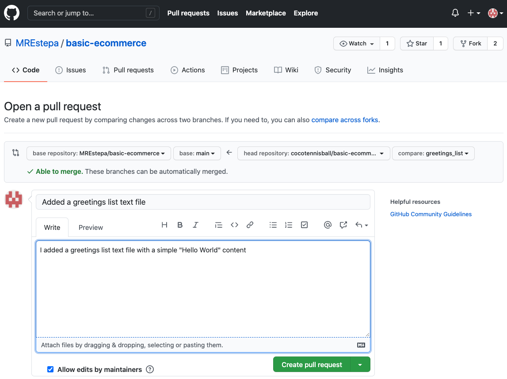

# Contributing to a Repository Walkthrough

This tutorial is an **ultimate step by step walkthrough** aimed to teach people who are new to Git and Github on **how to contribute to Github Projects**. 


Here is the workflow and the general idea:

1. **Navigate to the project** that you want to contribute to, and **Fork it**. The main repository that you forked is called `upsteam`. Your fork is called `origin`.
2. **Clone the project** that you just Forked **to your local machine**. The repository that is sitting on your local machine is called `local`.
3. **Configure the commit settings** on your local machine, including the `upstream` link.
4. **Create a new branch on your local machine**, and push this branch to your `origin`.
5. **Add your code changes/contributions to this branch**, and push commits to your `origin` as you normally would.
6. When you want to submit your changes, **update your local repository first**. This is done by pulling the changes from the `upstream` into your `local`. 
7. **Update your branch that you made some changes** from your updated local repository (called `rebase`), and push this this updates, as well as your contributions to your `origin`**.**
8. **Create a pull request** from the branch containing your contributions in your `origin` to the `dev` (or `main`) branch of the `upstream`.

9. When your pull request is not yet merged, **always update your pull request to avoid merging conflicts.** This is done from step 6 until this step.
10. When creating another contribution, follow from step 4.


## Prerequisites

1. Basic knowledge on **terminal** (or command promt) commands.
2. **Installed `git`** on your local machine. To check if you have git installed, navigate to terminal and type

```bash
$ git --version  # should output your git version. for example
# git version 2.24.3 (Apple Git-128)
```

If you do not have git installed, [check this documentation](https://git-scm.com/book/en/v2/Getting-Started-Installing-Git). If you do not know any basic terminal commands, I suggest you learn about basic commands (you can try [this link](https://www.techrepublic.com/article/16-terminal-commands-every-user-should-know/) for your reference).


## Git Workflow

### 1. Forking Github Repositories

1. **Navigate to the github repository** that you want to contribute to, and simply **click Fork** (Labelled 1 in the attached image). In this tutorial we are going to clone the `basic-ecommerce` repository.


2. You will know that you have successfully forked the repository when the **repository owner has changed** into your name (Labelled 2 in the previous image). Notice the fork icon beside your name.


3. The **original repository** (the one you forked) is called the `upstream`, while your **forked repository** (the one with your name on it) is called the `origin`.


### 2. Cloning Your Forked Repository

1. Locate the **"(download) Code"** button (Labelled 1 in the image), click it and **click the clickboard** icon (Labelled 2 in the image) to copy the repository link.


2. In your terminal, cd into the folder where you want to store your repository and type `git clone ` and **paste the link that you copied**. `cd` into your newly cloned repository, and type `ls` to verify that you have successfully cloned the `origin`.

```bash
$ git clone <your_repository link>
$ cd <your_repository_name>
$ ls
```


### 3. Configure Your Commit Settings

1. **Configure your commit settings** as follows:

```bash
# To configure your user name:
# git config user.name "your_name_here"
git config user.name "Coco"

# To configure your user email:
# git config user.email "your_email@here"
git config user.email "coco@mymail.com"

# Type this to see if your changes has been reflected
git config --list
```

you can add the `--global` to configure your settings globally.


2. **Add your `upstream`** by typing the command:

   ```bash
   $ git remote add upstream https://github.com/ORIGINAL_OWNER/ORIGINAL_REPOSITORY.git
   ```

   the link with `https://github.com/ORIGINAL_OWNER/ORIGINAL_REPOSITORY.git` can be copied from the **HTTPS link on the "Clone button" of the original repository or the `upstream`**

   

3. **Check your remote configurations** by typing:

   ```bash
   $ git remote -v
   ```

   you should have a f**etch and push for your `origin`** (your forked repository), and **fetch and push for the `upstream`** (the main repository).


### 4. Creating a New Branch

1. To **create a new branch**, type

```bash
$ git checkout -b <branch_name> origin/main
```

`checkout` is a command that lets you switch branches

`-b` tells git to create a new branch with the name of `<branch_name`

`origin/main` tells git to copy the code from the `main` branch of `origin` to this newly created branch.

2. **Push this branch to `origin`** so your `origin` would be updated. Type

```bash
$ git push -u origin <branch_name>
```


For this example, let's create a `greetings_list` branch.


### 5. Add your code changes

Edit the codebase as you normally would. In this tutorial we would create a `greetings_list.txt` and write a "Hello world" in it.


To push these changes:

1. **Check your edits** by typing `git status`, **add these changes** to staging by typing `git add .` (`.` means all. If you want you can specifiy what files you'd like to add). **Commit this changes** with a message by typing `git commit -m "<your_message>"`. Finally, **push these changes** to the `origin` by typing `git push -u origin <branch_name>`. In summary,

```bash
$ git status
$ git add .
$ git commit -m "<your_message_here>"
$ git push -u origin <branch_name>
```


2. Your edits **should now reflect** on your `origin` on the github page. Verify our `greetings_list.txt` is now in `origin`.


### 6. Updating local repository from upstream

When contributing to a project, it is high likely that your `local` repository is behind the `upstream` as many developers would merge their changes to the `master` (or `development`) branch of `upstream`. Before requesting for a pull request, we should update our `local` and `origin` repositories based on the changes of the `upstream`.

In this example, while we were editing our `greetings_list.txt` the main repository has already updated.


To update our `local` and `origin`, we can update our `local` `main` branch by:

```bash
$ git checkout <main_branch_name>
$ git fetch upstream
$ git merge upstream/<main_branch_name>
$ git push -u origin <origin_main_branch_name>:<local_main_branch_name> -f
```


### 7. Updating our local branch - REBASE

Our `greetings_list` branch is now behind our local `main` branch (which was just recently updated, see section 6). We also need to **update this branch** by `rebasing`.

```bash
$ git checkout <branch_name>
$ git fetch origin
$ git rebase origin/<main_branch>
# rebase your codes
$ git rebase --continue

#after rebasing, update origin branch
$ git push -u origin <branch_name> -f
```


### 8. Creating a pull request

1. You can create pull requests by **navigating in the branch that you were developing** (in our case, `greetings_list` Labelled 2 in the image) and clicking the "Compare & pull request" button (Labelled 1 in the image).


2. Edit the pul request title and the description based on the specifications of the project you are contributing to, and click **"Create pull request"**.
   

**Congratulations!** You just created your pull request. Pull request reviewers will review your code and add comments for you to change.


### 9. Updating Pull Requests

Expect that your pull requests will not be merged immediately, it might take hours, days, weeks, even months. (Or it might not be merged at all). 

**Always update your pull requests by following from step 6**, as outdated PRs will not be merged due to merge conflicts. Your reviewer might ask you to update your PR once it is ready for merging.


### 10. Create another contribution!

You've done it! **You can create another contribution by following from step 2**. 


### Your turn

Time get hands on. Fork this repository and contribute by adding you name (or your pet's name), your favorite phrase, or whatever you want in the `greetings_list.txt`. I might have spelling and grammatical errors, feel free to edit them.


I've compiled the commands in `commands.txt` for your reference. I've also added the command for deleting branch in your `local` and `origin`.

___

MREstepa

